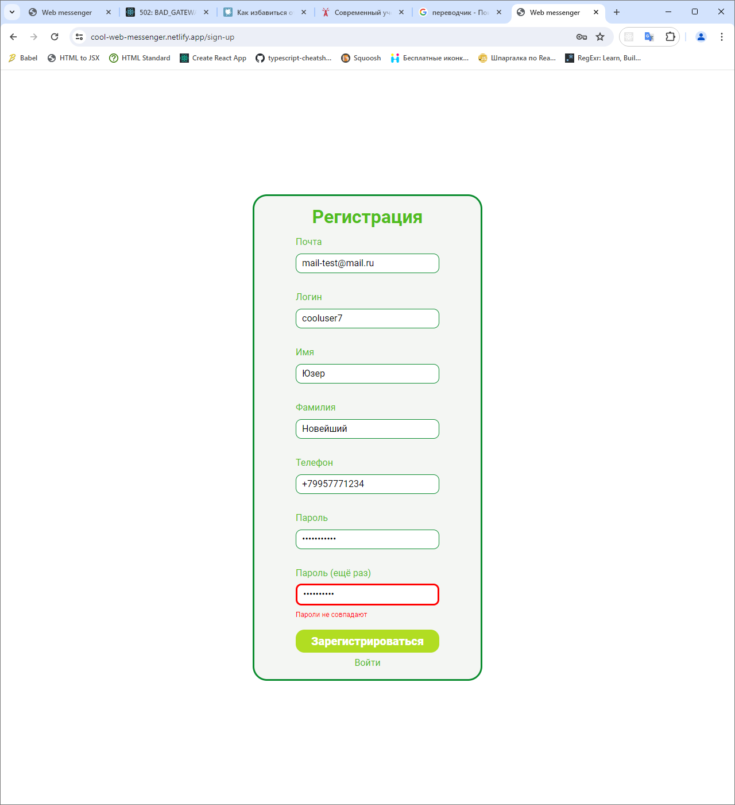
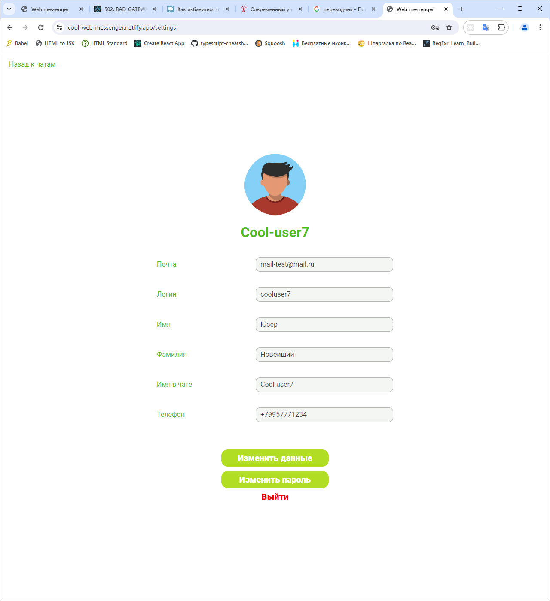
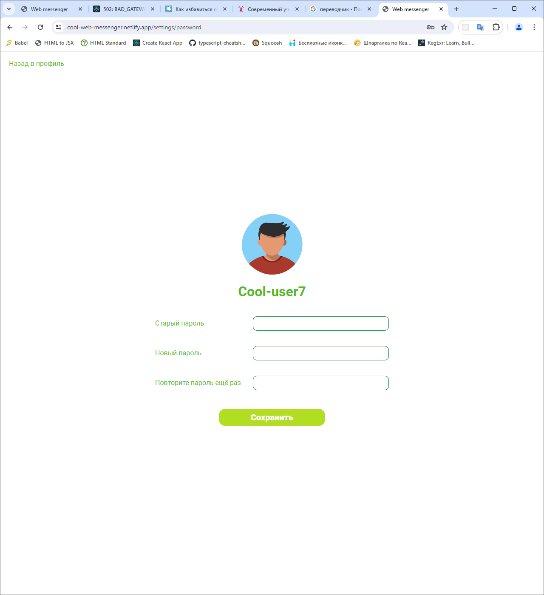
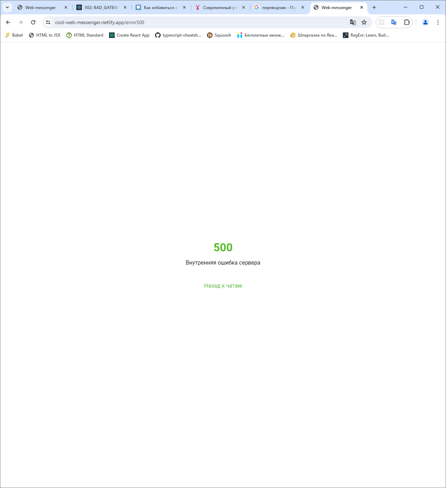

# Web messenger

## Описание

Веб-мессенджер — это приложение для общения через веб-интерфейс.

## Установка и запуск

- `npm install` — установка всех зависимостей;
- `npm run start` — сборка проекта и запуск локального сервера (http://localhost:3000/);
- `npm run build` — сборка проекта;
- `npm run dev` — запуск сервера для разработки (http://localhost:5173/);
- `npm run preview` — запуск локального сервера для просмотра производственной сборки;
- `npm run ts` — запуск проверки типов;
- `npm run prettier` — запуск форматтера кода **Prettier** для проверки правил форматирования исходного кода;
- `npm run prettier:fix` — запуск форматтера кода **Prettier** с автоматическим исправлением найденных ошибок;
- `npm run lint:ts` — запуск линтера **ESLint** для проверки правильности написания исходного кода на языке TypeScript;
- `npm run lint:ts:fix` — запуск линтера **ESLint** с автоматическим исправлением найденных ошибок;
- `npm run lint:scss` — запуск линтера **Stylelint** для проверки стилей, написанных с применением препроцессора SCSS;
- `npm run lint:scss:fix` — запуск линтера **Stylelint** с автоматическим исправлением найденных ошибок;
- `npm run test` — запуск тестов с применением тест-раннера **Mocha**;
- `npm run prepare` — установка библиотеки пре-коммит хуков **Husky**;
- `npm run pre-commit` — запуск пре-коммит хуков.

## Технологии в проекте

### 1. **Спринт 1**. На данном этапе выполнены следующие работы:

- Исходный код приложения написан на языке **JavaScript**.
- Для создания шаблонов страниц использован шаблонизатор **Handlebars**.
- Для написания стилей применён препроцессор **SCSS**.

### 2. **Спринт 2**. На данном этапе выполнены следующие работы:

- Исходный код приложения переписан на язык **TypeScript**:
  - в корне проекта создан файл `tsconfig.json` с настройками языка **TypeScript**;
  - в папке **src** в корне проекта создан файл `global.d.ts` с глобальными типами языка **TypeScript**;
  - в папке **src** в корне проекта создан файл `templates.d.ts` для поддержки языком **TypeScript** шаблонов **Handlebars**.
- Доработана страница чатов со списком чатов и лентой переписки.
- В проект добавлен компонентный подход:
  - написаны базовые компоненты **EventBus**, **Block**;
  - все компоненты, модули и страницы в проекте созданы на основе базового компонента Block.
- Сделан сбор данных из формы. В `console.log` выводится объект со всеми заполненными полями формы.
- Добавлена валидация на все формы:
  - форма на странице логина;
  - форма на странице регистрации;
  - форма для ввода нового сообщения на странице чатов;
  - форма на страницах изменения данных пользователя и пароля.
- Добавлен класс **HTTPTransport** для работы с http-запросами на основе **XMLHttpRequest**. Реализованы методы GET, POST, PUT, DELETE. Добавлена работа с query string в GET-запросе и с body в других методах.
- Добавлен форматтер кода **Prettier** для соблюдения единого стиля кода во всём проекте:
  - в корне проекта создан файл `.prettierignore` со списком файлов и папок, исключённых из проверки форматирования кода;
  - в корне проекта создан файл `.prettierrc` с правилами форматирования кода.
- Добавлен линтер **ESLint** для проверки кода на языке TypeScript:
  - в корне проекта создан файл `.eslintignore` со списком файлов и папок, исключённых из проверки правил написания кода;
  - в корне проекта создан файл `.eslintrc.json` с настройками линтера **ESLint**: правила наследуются от набора правил **airbnb**, добавлена поддержка языка **TypeScript**.
- Добавлен линтер **Stylelint** для проверки стилей CSS, SCSS: в корне проекта создан файл `.stylelintrc.json` с настройками линтера **Stylelint**.
- В корне проекта создан конфигурационный файл `.editorconfig` для поддержки согласованности стилей кодирования при работе над проектом в различных редакторах и IDE.

### 3. **Спринт 3**. На данном этапе выполнены следующие работы:

- В проект добавлен роутинг:
  - написаны базовые компоненты **Route**, **Router**;
  - создан общий на всё приложение инстанс класса **Router**;
  - В файле `main.ts` в него добавляются роуты и затем он используется в контроллерах для осуществления программной навигации;
  - у всех страниц приложения есть собственный роут:
    - `/` или `/index.html` — страница входа;
    - `/sign-up` — страница регистрации;
    - `/settings` — страница настроек профиля пользователя:
      - `/settings/data` — страница изменения данных пользователя;
      - `/settings/password` — страница изменения пароля;
    - `/messenger` — страница чатов;
    - `/error404` - страница 404;
    - `/error500` - страница 500;
  - в **DOM** активна только одна страница (при переходе на новую страницу старая удаляется из него);
  - при обновлении страницы с определённым **URL** отображается та же самая страница;
  - переходы по страницам работают через нажатие на ссылки в интерфейсе приложения;
  - работают переходы "назад" и "вперёд", как через интерфейс браузера, так и через роутер;
  - при переходе по несуществующему роуту пользователь перенаправляется на страницу 404;
  - при попытке войти в приложение неавторизованного пользователя он перенаправляется на страницу входа;
  - при возникновении внутренней ошибки сервера пользователь перенаправляется на страницу 500.
- В проект внедрено `HTTP API` чатов, авторизации и пользователей. Добавлено следующее:
  - авторизация в полном объеме (контроллер **AuthController**):
    - регистрация;
    - авторизация;
    - выход из системы;
  - работа с информацией пользователя (контроллер **UserController**):
    - изменение данные пользователя;
    - изменение аватара;
    - изменение пароля;
  - работа с чатами (контроллеры **ChatController** и **ChatUsersController**):
    - просмотр списка чатов пользователя;
    - создание нового чата;
    - удаление чата;
    - изменение аватара чата;
    - добавление пользователя в чат;
    - удаление пользователя из чата.
- В проекте подключен протокол **WebSocket** для работы с **real-time** сообщениями:
  - написан базовый компонент **WSTransport**;
  - создано **API** чатов (**MessagesAPI**) для мгновенного обмена сообщения по протоколу **WebSocket**;
  - создан общий на всё приложение инстанс **API** чатов, который используется для мгновенного обмена сообщениями.

### 4. **Спринт 4**. На данном этапе выполнены следующие работы:

- В проект добавлены тесты:
  - для запуска тестов применён тест-раннер **Mocha**;
  - для тестовых утверждений используется библиотека **Chai**;
  - для заглушек и стабов в тестах используется библиотека **Sinon**;
  - для создания в тестах браузерного окружения применена библиотека **JSDOM**;
  - написаны тесты на следующие компоненты:
    - на роутер (файл **Router.spec.ts**);
    - на компонент (файл **Block.spec.ts**);
    - на модуль отправки запросов (файл **HTTPTransport.spec.ts**);
  - в файл **package.json** добавлен скрипт `test` для запуска тестов.
- В проект добавлены пре-коммит хуки:
  - установлен пакет **lint-staged** для запуска проверок перед коммитом только изменившихся файлов;
  - создан файл **.lintstagedrc.json** со списком команд, запускаемых перед git-коммитом;
  - подключена библиотека пре-коммит хуков **husky**;
  - в корне проекта в папке `.husky` создан файл **pre-commit** со списком команд, запускающихся перед каждым git-коммитом;
  - в файл **package.json** добавлен скрипт `pre-commit` для запуска проверок перед коммитом.
- Проведён аудит пакетов, устранены найденные уязвимости.

## Ссылка на шаблоны страниц в Figma

https://www.figma.com/file/ztRVwTa1FVh3I42YLFFOyE/Web-messenger?type=design&node-id=0%3A1&mode=design&t=0G3GbYznBYrYK8db-1

## Работа с ветками

При разработке проекта используются следующие ветки в git:

- `main` - стабильная ветка;
- `sprint_i`, где i - номер спринта - ветка для разработки;
- `deploy` - ветка для деплоя на хостинг в интернете.

Разработка ведётся в ветке sprint_i, где i - номер спринта. Она регулярно мёрджится в ветку deploy для проверки работы на реальном хостинге. После завершения работы в спринте ветка sprint_i, где i - номер спринта, пуллреквестится в ветку main. При принятии пуллреквеста ветка sprint_i, где i - номер спринта, мёрджится в ветку main.

## Хостинг в интернете

https://cool-web-messenger.netlify.app - готовый проект на бесплатном хостинге Netlify

## Ссылки на все страницы

### Ссылки на все страницы в dev сборке на сервере для разработки:

- http://localhost:5173 или http://localhost:5173/index.html — страница входа;
- http://localhost:5173/sign-up — страница регистрации;
- http://localhost:5173/messenger — страница чатов;
- http://localhost:5173/settings — страница настроек профиля пользователя;
- http://localhost:5173/settings/data — страница изменения данных пользователя;
- http://localhost:5173/settings/password — страница изменения пароля;
- http://localhost:5173/error404 - страница 404;
- http://localhost:5173/error500 - страница 500.

### Ссылки на все страницы на локальном сервере:

- http://localhost:3000 или http://localhost:3000/index.html — страница входа;
- http://localhost:3000/sign-up — страница регистрации;
- http://localhost:3000/messenger — страница чатов;
- http://localhost:3000/settings — страница настроек профиля пользователя;
- http://localhost:3000/settings/data — страница изменения данных пользователя;
- http://localhost:3000/settings/password — страница изменения пароля;
- http://localhost:3000/error404 - страница 404;
- http://localhost:3000/error500 - страница 500.

### Ссылки на все страницы на хостинге Netlify:

- https://cool-web-messenger.netlify.app или https://cool-web-messenger.netlify.app/index.html — страница входа;
- https://cool-web-messenger.netlify.app/sign-up — страница регистрации;
- https://cool-web-messenger.netlify.app/messenger — страница чатов;
- https://cool-web-messenger.netlify.app/settings — страница настроек профиля пользователя;
- https://cool-web-messenger.netlify.app/settings/data — страница изменения данных пользователя;
- https://cool-web-messenger.netlify.app/settings/password — страница изменения пароля;
- https://cool-web-messenger.netlify.app/error404 - страница 404;
- https://cool-web-messenger.netlify.app/error500 - страница 500.

## **Примеры использования**

1. Страница логина:

   

2. Страница регистрации:

   

3. Страница чатов:

   

4. Страница профиля:

   

5. Страница изменения данных пользователя:

   

6. Страница изменения пароля:

   

7. Страница 404:

   

8. Страница 500:

   
